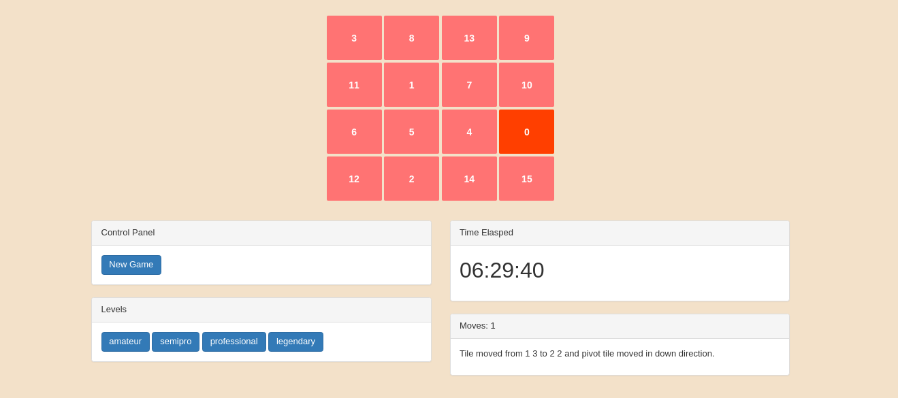

# `angular-slide-game`


## Getting Started

To get you started you can simply clone the `angular-slide-game` repository and install the dependencies

### Screenshot



### Prerequisites

#### Clone `angular-slide-game`

Clone the `angular-slide-game` repository using git:

```
git clone https://github.com/ayusharma/angular-slide-game.git
cd angular-slide-game
```

### Install Dependencies

We have preconfigured `npm` to automatically run `bower` so we can simply do:

```
npm install
```

### Demo
https://ayusharma.github.com/angular-slide-game/demo
